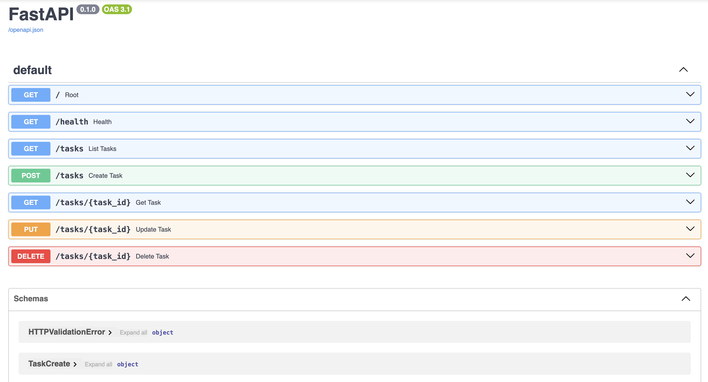

# Task API

I built this CRUD API to manage a simple to-do list while getting hands-on experience with backend development in Python using FastAPI. Through this project, I practiced designing robust REST endpoints, implementing input validation, and mapping appropriate HTTP status codes to different server responses. I also utilized FastAPI's built-in Swagger UI to interactively test my routes and ensure everything works seamlessly.

## Features

- Create, read, update, and delete tasks
- View all tasks or a single task by ID
- Validation that rejects empty titles
- JSON error messages with correct HTTP status codes
- Interactive testing through Swagger UI

## Technologies Used

- Python
- FastAPI
- Uvicorn
- Git & GitHub

## How to Run

Install dependencies:

```
pip install -r requirements.txt
```

Start the server:

```
uvicorn main:app --reload
```


## Endpoints

| Method | Endpoint | Purpose | Success Code |
|--------|----------|---------|--------------|
| GET | `/` | Describe the API | 200 |
| GET | `/health` | Check the server is running | 200 |
| GET | `/tasks` | List all tasks | 200 |
| GET | `/tasks/{task_id}` | Get one task | 200 |
| POST | `/tasks` | Create a task | 201 |
| PUT | `/tasks/{task_id}` | Update a task | 200 |
| DELETE | `/tasks/{task_id}` | Delete a task | 204 |

## Example curl Output

```
$ curl -i http://127.0.0.1:8000/tasks/1
HTTP/1.1 200 OK
date: Tue, 14 Jul 2026 23:32:43 GMT
server: uvicorn
content-length: 45
content-type: application/json

{"id": 1, "title": "Buy milk", "done": false}
```
## Swagger UI



## In-Memory Storage

For simplicity, this API stores all tasks directly inside a standard Python list rather than a persistent database. This means that any tasks you create, update, or delete will completely reset whenever the Uvicorn server restarts.


## Stage 4: Example SQL Query

Query:
SELECT * FROM tasks WHERE done = 1;

Result: Returns all completed tasks.x